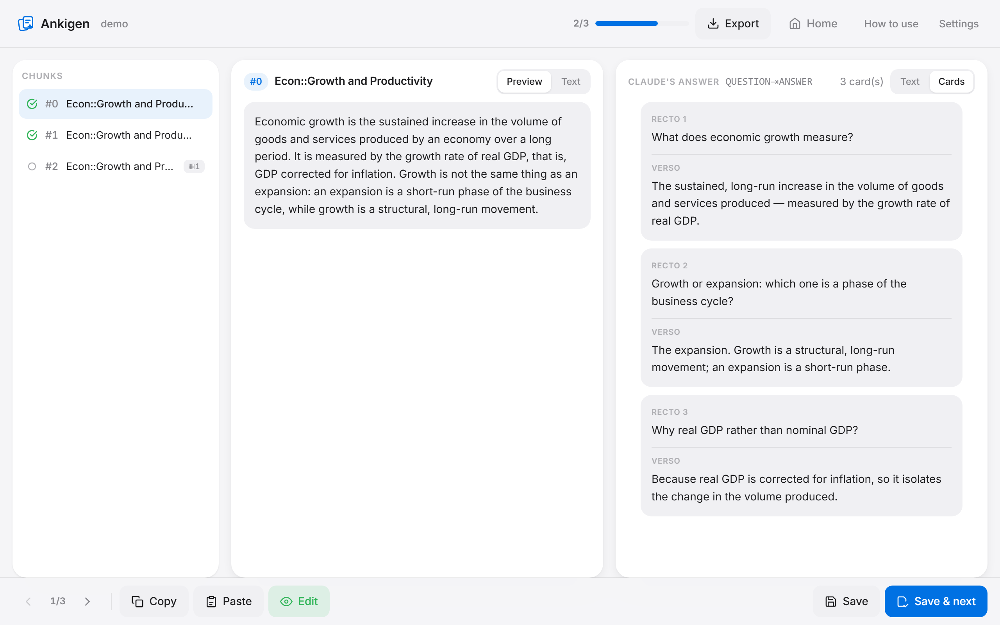
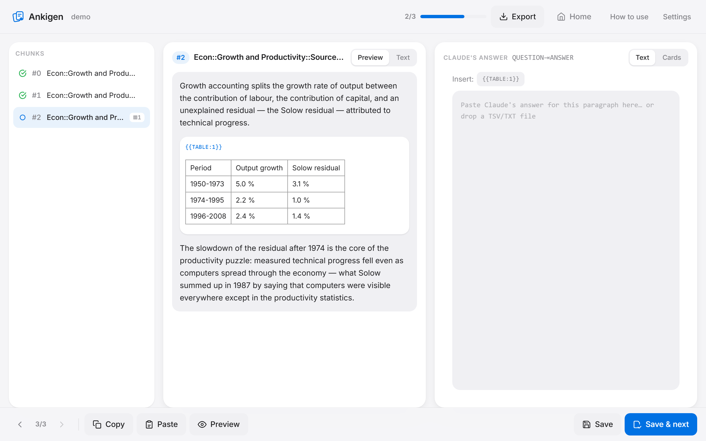

# Ankigen

**Transformez un cours `.docx` en deck Anki, un paragraphe à la fois.**

[](LICENSE)
[](https://github.com/leoprosy/Anki-Gen/releases/latest)
[](https://github.com/leoprosy/Anki-Gen/releases/latest)

[**Télécharger pour Windows**](https://github.com/leoprosy/Anki-Gen/releases/latest) · [Contribuer](CONTRIBUTING.md) · [Discussions](https://github.com/leoprosy/Anki-Gen/discussions) · [🇬🇧 Read in English](README.md)



---

## Pourquoi

Fabriquer ses cartes est la partie la plus lente des révisions, et coller un chapitre entier dans un
chatbot ne règle rien : le modèle survole, les cartes sortent creuses, et toutes les images et tous
les tableaux du document se perdent en route.

Ankigen conserve la structure du document au lieu de l'aplatir. Il découpe le cours selon ses styles
de titre, vous donne **un paragraphe à la fois** — avec les images et les tableaux qui lui
appartiennent — et transforme le chemin des titres en chemin de deck Anki. Vous envoyez ce
paragraphe à Claude (ou à l'assistant de votre choix), vous recollez la réponse, et Ankigen
s'occupe de la plomberie : marqueurs de médias, tableaux HTML, en-tête `#separator:tab`, copie des
images dans votre collection Anki.

Le traitement des cours tourne sur votre machine. **Ni clé d'API ni compte** requis :
les cartes sont écrites dans la conversation que vous payez déjà. Le contenu des cours
reste sur votre ordinateur, sauf le paragraphe que vous choisissez de coller.

Les statistiques d’utilisation sont facultatives et **désactivées par défaut**.
Vous pouvez les activer dans les paramètres pour partager des compteurs d’activité
et d’exports avec le développeur via PostHog. Aucun document, nom de fichier ou
contenu de carte n’est transmis. Les champs et leur configuration sont détaillés
dans le [guide du tableau de bord privé](docs/analytics.md).

---

## Installation

**Windows (recommandé).** Téléchargez le fichier `Ankigen_x.y.z_x64-setup.exe` de la
[dernière release](https://github.com/leoprosy/Anki-Gen/releases/latest) et lancez-le.
Python n'est pas nécessaire : l'installeur embarque tout.

**Depuis les sources (Windows, macOS, Linux).** Voir [Lancer depuis les sources](#lancer-depuis-les-sources).

---

## Comment ça marche



1. **Import** d'un `.docx` dont les titres utilisent de vrais styles de titre (`Titre 1`, `Titre 2`…
   ou leurs équivalents anglais). Le découpage repose sur ces styles, pas sur la numérotation que
   vous avez tapée.
2. **Parsing.** Ankigen découpe le cours en chunks, un par section, extrait les images et les
   tableaux, et enregistre un projet en local. Le chemin de deck de chaque chunk reprend la
   hiérarchie des titres (`ESH::La croissance::Les sources de la croissance`).
3. **Génération.** Copiez le chunk courant, envoyez-le à Claude, qui répond en TSV
   (`question <tab> réponse`). Ankigen n'embarque aucun prompt système : la page **Mode d'emploi**
   de l'application explique comment écrire votre propre
   [Skill Claude](https://docs.claude.com/en/docs/agents-and-tools/agent-skills/overview)
   d'écriture de cartes, template à copier inclus.
4. **Vérification.** Collez la réponse, passez à l'onglet **Cartes** pour voir le rendu, puis
   *Enregistrer & suivant*.
5. **Export.** TSV seul, ZIP avec les images, ou copie directe des médias dans votre
   `collection.media`. Importez ensuite le TSV via *Fichier > Importer* : le séparateur, le HTML et
   la colonne de deck sont déjà déclarés dans l'en-tête du fichier.

Les projets sont persistants : fermez l'application, revenez, reprenez où vous en étiez.

---

## Images et tableaux du .docx

**Les images** sont extraites dans `media/<projet>/`, sous un nom dérivé de leur SHA-1 et préfixé par
l'identifiant du projet (`ag_<projet>_<sha1>.png`) : le `collection.media` d'Anki est un espace de
noms **plat et global**. Une image répétée n'est écrite qu'une fois. Les formats qu'Anki ne sait pas
afficher (emf, wmf, tiff, bmp…) sont convertis en PNG, et les images de plus de 1200 px de large sont
réduites. Le **texte alternatif** du document (Word : « Texte de remplacement » ; Google Docs :
« Texte alternatif ») accompagne le paragraphe ; s'il manque, l'interface met l'image en évidence et
permet de saisir la description à la main — le prompt est aussitôt re-généré.

**Les tableaux** sont reconstruits avec leurs fusions (`colspan` / `rowspan`), leurs tableaux
imbriqués et les images de leurs cellules. Ils partent vers Claude en **markdown** (compact en
tokens) et sont réinjectés dans les cartes en **HTML autonome** (CSS inline, défilement horizontal
sur mobile).

**Les marqueurs.** Le modèle n'écrit jamais de balise `` ni de nom de fichier. Il place des
marqueurs, qu'Ankigen remplace à l'export :

| Marqueur | Devient |
|---|---|
| `{{IMG:1}}` | `` |
| `{{TABLE:1}}` | le tableau complet en HTML |

La numérotation est **locale au chunk**. Un marqueur inventé par le modèle est supprimé à l'export et
signalé dans le rapport ; les boutons d'insertion de l'interface permettent d'ajouter un marqueur
oublié, et l'onglet **Cartes** montre le rendu final avant l'import.

---

## Lancer depuis les sources

```bash
git clone https://github.com/leoprosy/Anki-Gen.git
cd Anki-Gen
python -m venv .venv
.venv/Scripts/python.exe -m pip install -r requirements.txt   # Windows
# source .venv/bin/activate && pip install -r requirements.txt  # macOS / Linux
.venv/Scripts/python.exe app.py
```

Rendez-vous ensuite sur <http://127.0.0.1:5000>. Le port se change avec `ANKI_GEN_PORT` (utile quand
l'application installée occupe déjà le 5000) :

```bash
ANKI_GEN_PORT=5051 .venv/Scripts/python.exe app.py
```

Pour lancer la fenêtre native en mode dev, démarrez d'abord le serveur Flask, puis :

```bash
npm install
npm run tauri dev
```

---

## Compiler l'application Windows

L'application desktop est une coque [Tauri](https://tauri.app) autour du serveur Flask, lui-même
compilé en binaire « sidecar » autonome par PyInstaller.

```powershell
# 1. Sidecar — le fichier flask-server.spec versionné contient déjà les imports cachés
.venv\Scripts\pyinstaller.exe --noconfirm flask-server.spec

# 2. Le placer pour Tauri, sous le nom de la cible de compilation (-gnu si toolchain GNU)
Copy-Item dist\flask-server.exe src-tauri\binaries\flask-server-x86_64-pc-windows-msvc.exe -Force

# 3. Packager
npm run build
```

Les installeurs se trouvent dans `src-tauri/target/release/bundle/`. Pousser un tag `v*` rejoue les
mêmes étapes en CI ([`.github/workflows/release.yml`](.github/workflows/release.yml)) et attache le
`.exe` et le `.msi` à la release.

---

## Où sont stockées les données ?

- **Depuis les sources** (`python app.py`) : dans le dossier du projet — `projects/`, `uploads/`,
  `media/`, `exports/`.
- **Dans l'application packagée** : dans `%APPDATA%\AnkiGen\` (`settings.json`, `projects/`,
  `uploads/`, `media/`, `exports/`). C'est indispensable : un exécutable PyInstaller *onefile* est
  déballé dans un dossier temporaire, et tout ce qui y serait écrit disparaîtrait à la fermeture.

---

## Tests

```bash
.venv/Scripts/python.exe -m unittest discover -s tests
```

Les fixtures `.docx` (images avec/sans alt, image seule dans un paragraphe, image répétée, fusions
horizontales et verticales, tableau imbriqué, image en cellule) sont générées à la volée par
`tests/make_fixtures.py` — rien de binaire n'est versionné.

---

## Contribuer

Les issues étiquetées [`good first issue`](https://github.com/leoprosy/Anki-Gen/issues?q=is%3Aissue+is%3Aopen+label%3A%22good+first+issue%22)
sont le meilleur point de départ, et [CONTRIBUTING.md](CONTRIBUTING.md) décrit l'installation, les
conventions et l'organisation du code. Les Skills d'écriture de cartes, les conventions de deck et
les idées de flux de travail vont dans les
[Discussions](https://github.com/leoprosy/Anki-Gen/discussions).

## Licence

Ankigen est un logiciel libre, publié sous **GNU General Public License v3.0 ou ultérieure**.
Voir [LICENSE](LICENSE). Copyright (C) 2026 leoprosy.
