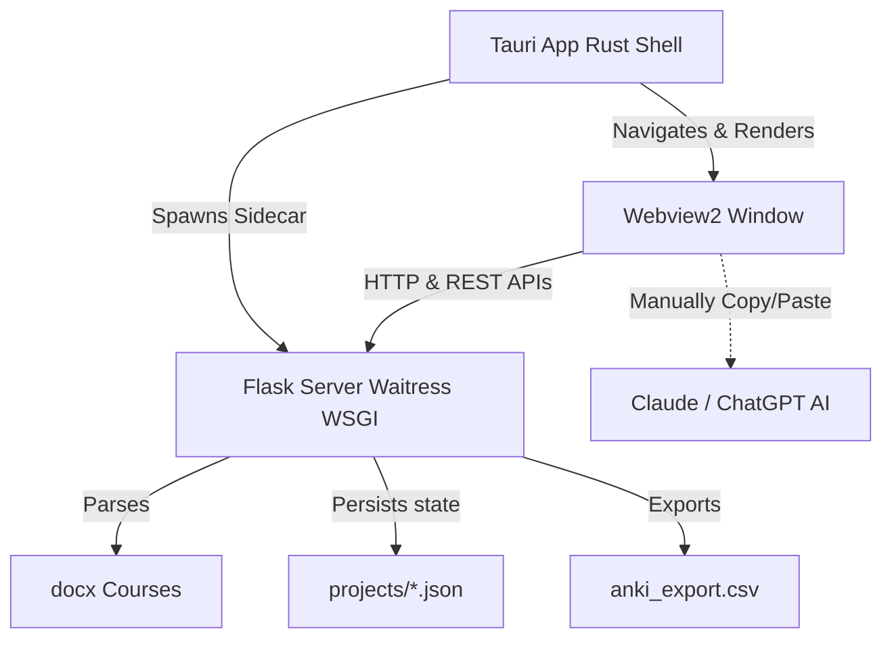

# Anki ESH (Anki-Gen) — Project Documentation

Anki ESH (also referred to as `Anki-Gen`) is a local hybrid desktop and web application designed to parse course documents in Microsoft Word format (`.docx`), chunk them according to their section headings, generate formatted Anki flashcards (Questions/Answers in HTML style) paragraph-by-paragraph using LLMs (e.g. Claude or ChatGPT), and export the resulting cards to an Anki-compatible TSV/CSV format.

---

## 🏗️ Architectural Overview

The application utilizes a **hybrid backend/frontend desktop wrapper architecture**:



- **Tauri Shell (Rust):** Acts as the desktop client window wrapper. On startup, it spawns the Flask server in sidecar mode and loads the local server's URL in a Webview window once active.
- **Flask Server (Python):** Handles the file parsing, session persistence (projects structure), REST endpoint logic, and file export formatting. Runs on Waitress in production.
- **Vanilla Frontend (HTML/CSS/JS):** A fast, clean, single-page application interface adhering to a strict minimalist style guide.

---

## 🛠️ Technology Stack

| Layer | Technology | Purpose |
| :--- | :--- | :--- |
| **Desktop Shell** | Rust + Tauri v2 | Native OS shell, resource bundling, and sidecar management |
| **Backend Framework** | Python 3 + Flask | Application routing, JSON serialization, and project management |
| **WSGI Server** | Waitress | Production-grade web server running inside the binarized package |
| **Document Parser** | python-docx + lxml | Structural document extraction and paragraph scanning |
| **Frontend Core** | HTML5, CSS3, ES6 JavaScript | Interface layout, application logic, and user interactions |
| **Font Family** | Inter (Google Fonts) | Apple-inspired clean typography system |
| **Packaging Tools** | PyInstaller + Tauri CLI | Bundling Python code into a standalone `.exe` sidecar and compiling the MSI/EXE installers |

---

## 📂 Project Structure

```
Anki-Gen/
├── app.py                # Main Flask routing, API endpoints, and project CRUD
├── parse_cours.py        # Logic for parsing .docx headings, hierarchy stack, and prompt building
├── build_anki_csv.py     # Script to convert raw model responses back into Anki CSV/TSV
├── launcher.py           # Production entry point: manages port conflicts, waitress server, browser launching
├── design.md             # Detailed style guide, colors, components, and motion rules
├── requirements.txt      # Python dependencies definition
├── package.json          # Node/NPM dependencies (Tauri CLI wrapper)
├── projects/             # Directory where course sessions are persisted (JSON files)
├── uploads/              # Temporary upload cache for parsed .docx files
├── templates/            # HTML views (Jinja2 templates)
│   ├── base.html         # Document shell, typography loader, header layout
│   ├── upload.html       # Landing page: drop-zone upload & active project list
│   └── work.html         # Workspace: sidebar of chunks, system prompts, copy-paste workspace
├── static/               # Assets serving
│   ├── app.js            # Frontend single-page workspace logic (state changes, transitions, clipboard)
│   └── style.css         # Apple-inspired light styling system
└── src-tauri/            # Tauri project definition
    ├── src/
    │   ├── main.rs       # Rust entrypoint calling lib.rs
    │   └── lib.rs        # Tauri configuration hook: sidecar spawner, port ping loop
    ├── binaries/         # Binaries directory containing PyInstaller's built server executable
    └── tauri.conf.json   # Tauri configuration definitions (windows, sidecars, packages)
```

---

## ⚙️ Modules & Methods Reference

### 1. Backend Routing (`app.py`)

Handles all Web requests, templates rendering, API execution, and project states.

*   `sanitize_filename(filename)`
    *   **Goal:** Sanitizes input file names to form clean, safe strings.
    *   **Return:** `str` (sanitized project ID).
*   `load_prompts(project_id)` / `save_prompts(project_id, prompts)`
    *   **Goal:** Read and write project progress lists in JSON files inside the `/projects` directory.
*   `progress(prompts)`
    *   **Goal:** Analyzes a project's state statistics.
    *   **Return:** `dict` detailing `{"total": int, "done": int, "pending": int}`.
*   `GET /` (`index()`)
    *   **Goal:** Scans the `projects/` directory, compiles all current project metadata and progress rates, and displays them on the dashboard (`upload.html`).
*   `POST /upload` (`upload()`)
    *   **Goal:** Receives a uploaded `.docx` file, copies it to `uploads/`, parses it with `parse_docx()`, creates prompt blocks via `build_prompts()`, and saves the file in `projects/`. Redirects to workspace.
*   `GET /work/<project_id>` (`work(project_id)`)
    *   **Goal:** Loads the target project and renders the main workspaces page (`work.html`).
*   `POST /api/save/<project_id>` (`api_save(project_id)`)
    *   **Goal:** Save the LLM response of a specific chunk. If a valid response is provided, flags status to `done` and parses the cards structure; otherwise flags it as `pending`.
*   `GET /api/state/<project_id>` (`api_state(project_id)`)
    *   **Goal:** Provides current state representation as JSON.
    *   **Return:** JSON containing the list of prompts and calculated progress statistics.
*   `GET /export.csv/<project_id>` (`export_csv(project_id)`)
    *   **Goal:** Exports all saved HTML cards as tab-separated values. Writes a local copy to `[project_id]_export.csv` at the project root and delivers it as an attachment response.

### 2. Document Parser (`parse_cours.py`)

Processes Word files and identifies titles to build structural sub-decks.

*   `detect_level(para)`
    *   **Goal:** Parses paragraph objects from the docx document, checks their styling names against standard Word/Google Docs styling maps (`Heading 1-4`, `Titre 1-4`), and matches them against regular expression patterns:
        *   Level 1: `I.`, `II.`, `I)`, ... (Roman numerals)
        *   Level 2: `A.`, `B.`, `A)`, ... (Uppercase letters)
        *   Level 3: `1.`, `2.`, `1)`, ... (Digits)
        *   Level 4: `a.`, `b.`, `a)`, ... (Lowercase letters)
    *   **Return:** `(level: int, text: str)` where `level=0` corresponds to body contents.
*   `build_deck_path(stack, prefix)`
    *   **Goal:** Reconstructs the hierarchy tree stack into a nested Anki deck path (e.g. `*ESH*::I - Croissance::A) Modèles`).
*   `parse_docx(path, deck_prefix)`
    *   **Goal:** Iterates sequentially through document paragraphs, maintains a stack of current active section headings based on parsed level structures, flushes aggregated body text blocks, and groups them under their corresponding deck hierarchical path.
    *   **Return:** `list[dict]` containing `"deck"` and `"text"` keys.
*   `build_prompts(chunks)`
    *   **Goal:** Converts parsed chunks into standard application state lists. Each item has: `id`, `deck`, `prompt` (body text), `system` (the static `SYSTEM_PROMPT`), `status` (`pending`), and `response` (empty `""`).
*   `SYSTEM_PROMPT` (Static Constant Variable)
    *   **Goal:** The instruction injected into Claude to generate structured tab-separated flashcards. It enforces strict inline-HTML decoration mapping rules:
        *   **Dates:** `<span style="color: red; font-weight: bold; text-decoration: underline;">Date</span>`
        *   **Citations:** `<span style="background-color: plum; font-style: italic;">"Citation"</span>`
        *   **Book/Article title:** Yellow background color, italicized formatting.
        *   **Theories:** Red text color, bold.
        *   **Equations:** Uses MathJax latex notations inside `[latex]$...$[/latex]`.
        *   **Export separator:** Output must be generated using `TAB` delimiters: `QUESTION[TAB]RÉPONSE`.

### 3. CSV Assembly (`build_anki_csv.py`)

Performs offline compilation of final Anki sheets from backup JSONs.

*   `parse_tsv_response(raw_response)`
    *   **Goal:** Processes raw text responses pasted from Claude, extracts markdown syntax fences (such as ` ``` ` blocks), splits columns using commas or tab-stops, and filters out headers/extraneous lines.
    *   **Return:** `list[tuple[str, str]]` containing isolated Question/Answer columns.
*   *Note on direct execution:* Line 89 inside `build_anki_csv.py` calls `parse_csv_response` instead of `parse_tsv_response`. Running this file directly from the CLI command line will raise a `NameError` unless corrected. However, the Flask server calling the imported `parse_tsv_response` directly resolves this in the web pipeline.

### 4. Waitress Server & Launcher (`launcher.py`)

A production entrypoint handling application setups.

*   `find_free_port(start, end)`
    *   **Goal:** Scrapes and checks open sockets locally starting at port `5000` to avoid binding collisions.
*   `open_browser(port)`
    *   **Goal:** Opens the default browser window pointing to the active Flask session.
*   `main()`
    *   **Goal:** Starts waitress serving thread. If the environment variable `ANKI_ESH_SIDECAR` is `"1"`, the automatic browser launch step is bypassed, allowing the Tauri client window wrapper to display the site frame.

### 5. Frontend Script (`static/app.js`)

Manages client-side operations, navigations, and event cycles.

*   `transitionChunkView(callback)`
    *   **Goal:** Implements a visual transition cross-fade (triggers CSS class `switching` with `150ms` delays) while switching cards in the workspace.
*   `render()`
    *   **Goal:** Populates layout elements with the active chunk properties (ID, Deck string, body text to send to Claude, existing response, disabled states on nav arrows, and auto-scrolls the sidebar item).
*   `updateProgress()`
    *   **Goal:** Recalculates progress ratios and updates progress fill bar widths.
*   `updateCardsInfo()`
    *   **Goal:** Counts matching tab-stop or semicolon splits inside the response area to show a preview count of cards detected in the field.
*   `save({ advance: false })`
    *   **Goal:** Posts response contents asynchronously to `/api/save/<project_id>`, processes returned results, triggers CSS success pulses (`save-status` animation refresh), and optionally triggers `navigateTo(nextIdx)`.
*   *Interactivity:*
    *   `Ctrl + Enter` (or `Cmd + Enter`) acts as a shortcut for *Enregistrer & Suivant* (Save & Next).
    *   Drop listener on the textarea reads `.txt` or `.tsv` files dropped by the user via a `FileReader` instance.
    *   Clipboard integration: Copy buttons read elements from DOM nodes and store them. Paste button reads from `navigator.clipboard.readText()` to insert contents into the textarea.

---

## 🎨 Visual Design Guidelines

The visual framework is structured around minimalism ("remove everything that isn't necessary — then remove a little more") and complies with the following guidelines detailed in `design.md`:

1.  **Canvas & Surfaces:**
    *   `--bg`: `#F5F5F7` (Neutral soft warm light-grey canvas).
    *   `--surface`: `#FFFFFF` (Panel surfaces float above the background canvas).
    *   `--surface-alt`: `#F0F0F3` (Recessed zones like textareas and code blocks).
2.  **No Borders Rule:**
    *   No standard `border: 1px solid` rules are used.
    *   Elements are separated through whitespace margins, subtle shadows (`--shadow-md`, `--shadow-lg`), and surface contrast offsets.
3.  **Accent Budget:**
    *   `--accent` color is `#0071E3` (Apple Blue).
    *   It is used sparingly: only for primary CTA buttons, active sidebar dot indicators, input focused outer rings, and progress indicators.
4.  **Motion Parameters:**
    *   Transitions use a `0.15s` duration for hover animations and `0.2s` for save/interaction pulses.
    *   Enter/Exit timings follow cubic bezier curves: `cubic-bezier(0.25, 1, 0.5, 1)` for progress bars and load-in slide fades.

---

## 🚀 Running & Developing

### Development Mode

1.  **Start Flask Backend Server:**
    ```bash
    # Activate virtual environment
    .venv\Scripts\activate
    # Launch flask server
    python app.py
    ```
    The server will be reachable at `http://127.0.0.1:5000`.

2.  **Start Tauri Dev Window Wrapper:**
    ```bash
    npm run tauri dev
    ```
    *Note: Ensure the Flask server is running first, as Tauri dev targets port 5000.*

---

## 📦 Compilation & Distribution

To compile a standalone Windows executable (`.exe`) package containing the embedded Python environment and Tauri windows:

1.  **Compile Python Server Executable:**
    Run PyInstaller within the virtual environment:
    ```powershell
    .venv\Scripts\pyinstaller.exe --noconfirm --onefile --console --name flask-server launcher.py --add-data "templates;templates" --add-data "static;static" --hidden-import waitress --hidden-import flask --hidden-import jinja2.ext --hidden-import docx --hidden-import lxml --hidden-import lxml._elementpath --hidden-import lxml.etree
    ```
    This outputs the standalone executable binaire at `dist/flask-server.exe`.

2.  **Move Executable to Tauri Binaries Directory:**
    Copy the built executable into Tauri's binaries folder and rename it with the architecture target suffix:
    ```powershell
    Copy-Item dist\flask-server.exe src-tauri\binaries\flask-server-x86_64-pc-windows-gnu.exe -Force
    ```

3.  **Compile the final Tauri Desktop Installer:**
    ```bash
    npm run tauri build
    ```
    The MSI and EXE installer formats will be generated in `src-tauri/target/release/bundle/`.
